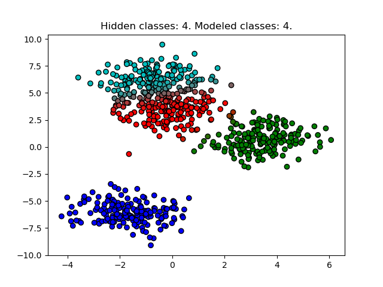

# Gaussian Mixture Models: clustering unlabeled data

Here is a simple implementation of Gaussian Mixture Models to cluster unlabeled data. [Sklearn already does this](http://scikit-learn.org/stable/modules/mixture.html)- this is simply for my own interest (what happens if we use softmax normalization as opposed to standard normalization? what sort of effect do various stopping criteria have on the result? etc.) and certainly not for actual use. 

### Expectation-Maximization (EM) optimization

### Todo: cluster on data not generated from Gaussians

For these images, we generate [Gaussian blobs data](http://scikit-learn.org/stable/modules/generated/sklearn.datasets.make_blobs.html#sklearn.datasets.make_blobs) with `hidden` number of classes and then model it data with GMM using `model` classes. `hidden` and `model` may not be the same (see below for results).

Also note that `make_blobs` may superimpose different blobs, so you may not visually see `hidden` blobs clearly.

