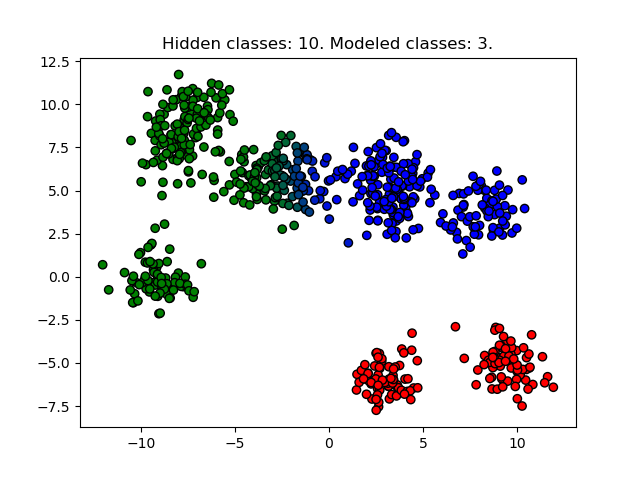

# Gaussian Mixture Models: clustering unlabeled data

Here is a simple implementation of Gaussian Mixture Models to cluster unlabeled data. [Sklearn already does this](http://scikit-learn.org/stable/modules/mixture.html)- this is simply for my own interest and certainly not for actual use.

### Expectation-Maximization (EM) optimization

### Todo: cluster on data not generated from Gaussians

For these images, we generate data from actual/hidden Gaussian components and then model the resulting data with GMM.

